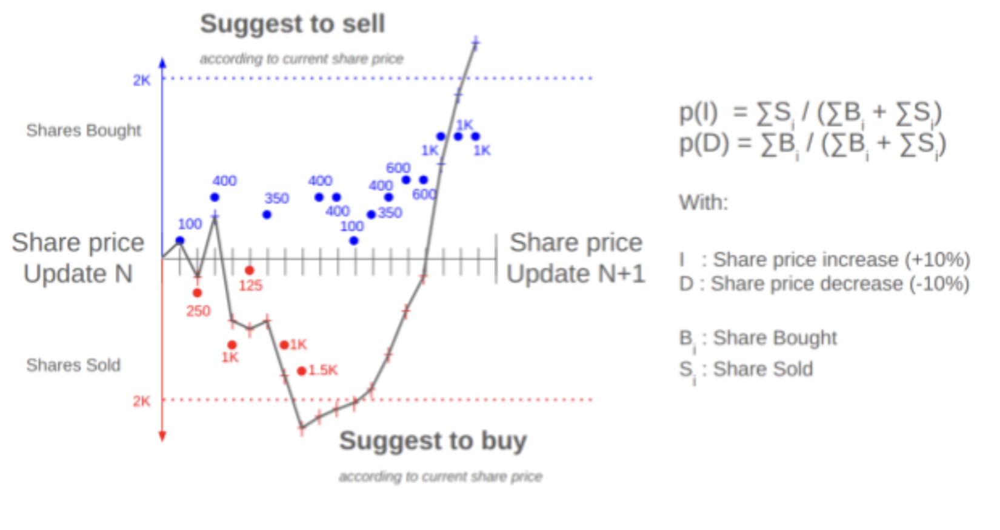

# Stock Exchange Technical Challenge

## Challenge

If you are both fast and eager you can make money in the Stock Exchange, as long as you have enough info. At least that is what our Stock Analyst says. She has developed an experimental model, that she calls _Eagy Broker_. It is based on tracking share movements faster than the share price is recomputed. Thus, assuming we have access to an Stock Exchanger that broadcasts both the current share price and the number of shares sold and bought, _Eagy Broker_ will suggest to buy a given share if the overall number of shares (i.e., total number of shares sold and bought) since the last share price update exceeds a total of 2K shares sold, as long as the current share price is at least 10% lower than the initial share price (i.e., the first one received). However, if the overall number of shares since the last share price update exceeds a total of 2K shares bought, _Eagy Broker_ will suggest to sell a given share, as long as the current share price is at least 10% higher than the initial share price.



Implement _Eagy Broker_ so that it could tell us when to buy and when to sell each share. For this initial implementation we will focus just on two companies, _Amazon_ and _Apple_, with share symbols _AMZN_ and _AAPLE_, respectively. For each type of share (i.e., _AMZN_ or _AAPLE_), _Eagy Broker_ will subscribe to a different Stock Exchanger that broadcasts the current price of the share (in USD) every minute, and the number of shares sold or bought every second. Each Stock Exchanger will randomly emit share sales or purchases with a 50% of probability each. In each case, the amount of shares either sold or bought will randomly range from 1 to 1K, following a uniform probability distribution. That is, there is exactly the same probability of emitting either 100 or 1K shares sale/purchase. The share price is randomly updated by each Stock Exchanger according to the amount of shares sold and bought since the last share price update, following the probability distribution shown above. Thus, the probability of increasing the share price in N+1 by 10%, with respect to the price in N, is p(I). In the example shown above, the sum of all shares bought (i.e., Bi) and sold (i.e., Si) is equal to 6,700 and 3,875, respectively, with a p(I) equal to 37%.

## Solution

### Run the solution

```shell
python stock_exchange_technical_challenge.py
```

### Testing 

```shell
python -m unittest discover -s tests
```

### Format

```bash
autopep8 --recursive --exclude venv --in-place .
```